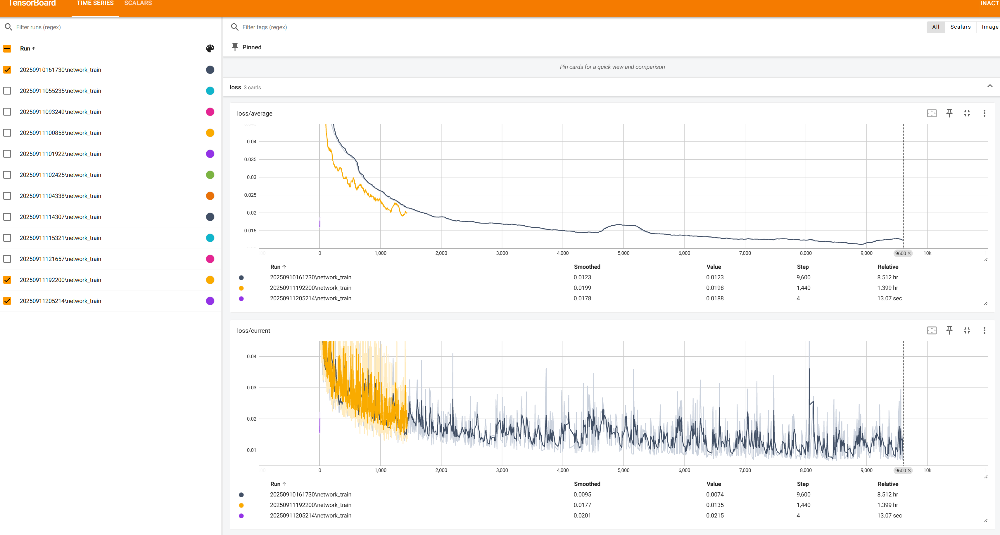
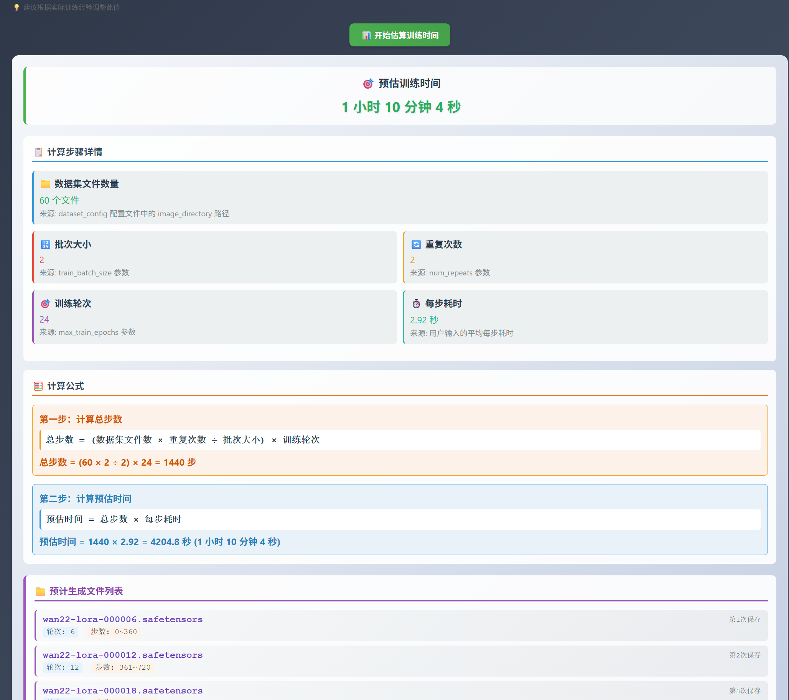
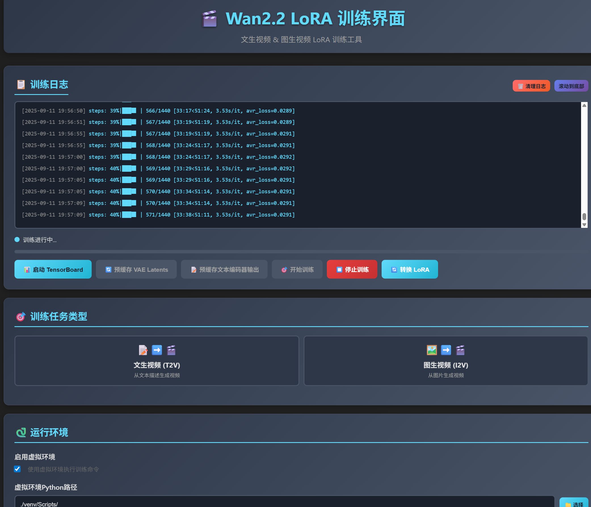
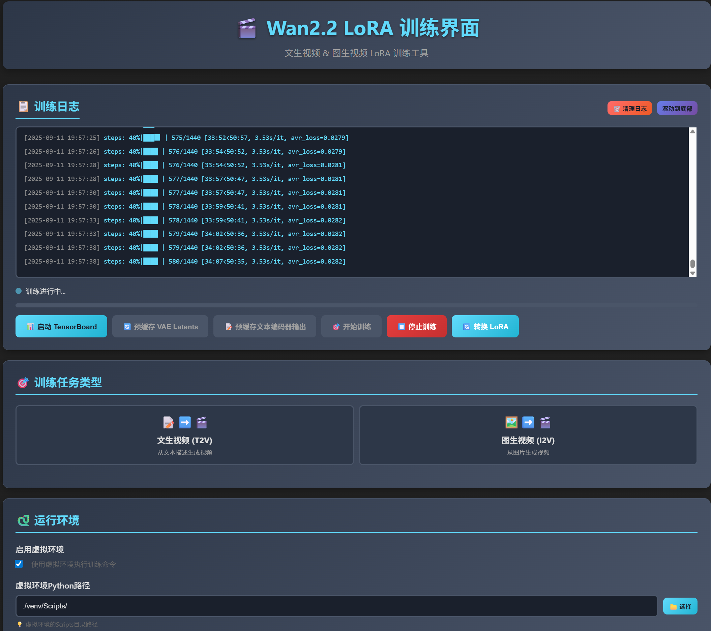
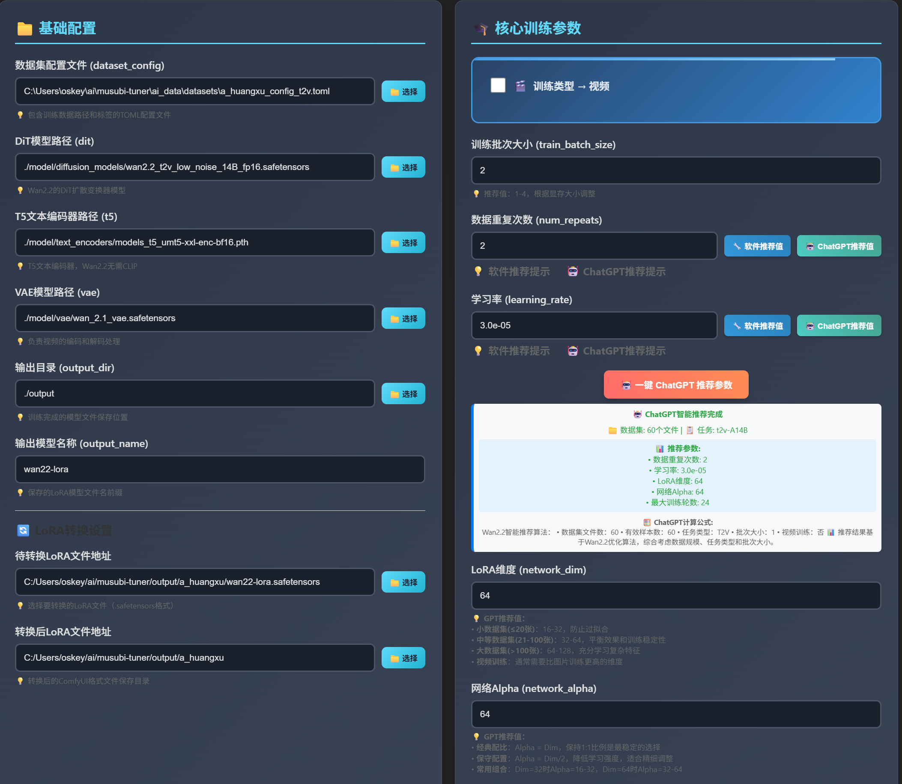
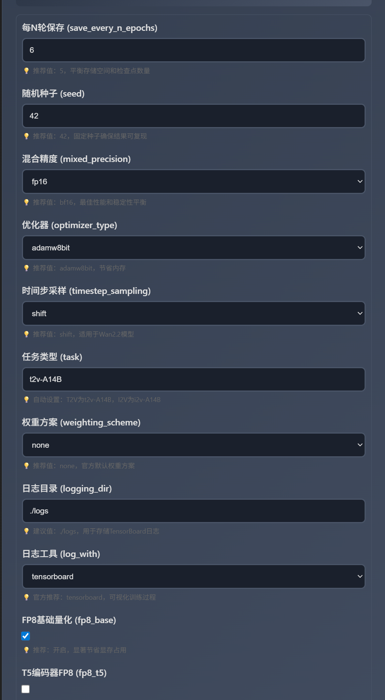
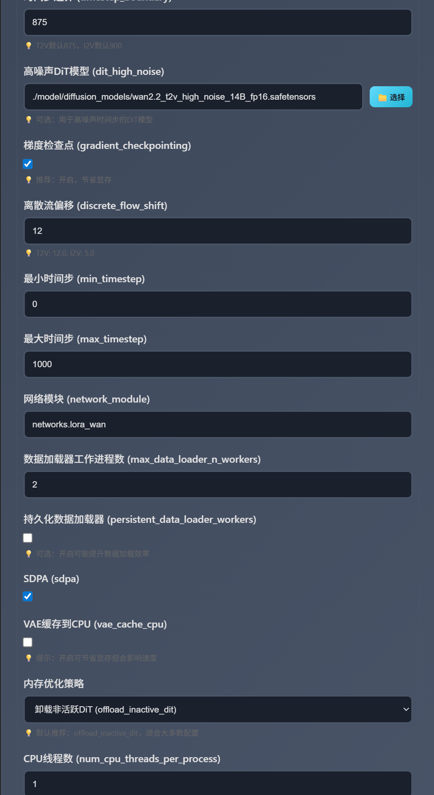
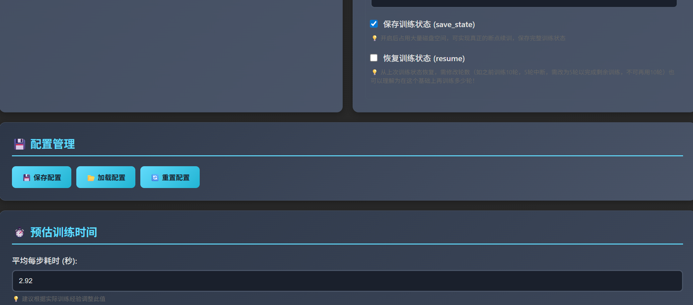

# Musubi-Tuner WebUI



🎯 **专业级AI视频/图像生成模型训练平台**

基于 [kohya-ss/musubi-tuner](https://github.com/kohya-ss/musubi-tuner) 的现代化Web界面扩展项目，为WAN2.2视频生成和Qwen-Image图像生成模型提供直观易用的LoRA训练解决方案。

💾 **智能训练状态管理**：支持训练进度自动保存与断点续训功能，让您可以随时中断训练并从指定检查点恢复，确保长时间训练任务的稳定性和连续性。

**🌟 让AI模型训练变得简单高效**
- 零基础用户也能轻松上手的智能参数推荐系统
- 专业用户可精细调控的完整参数配置
- 企业级的训练进度管理和断点续训功能
- 实时监控和可视化的训练过程

## 🚀 快速开始

### 方式一：已有官方仓库（推荐）

如果你已经有官方仓库，只需要下载WebUI文件：

1. **下载文件** - 从本项目下载以下文件到官方仓库根目录：
   - `wan22_webui.py`
   - `qwen_webui.py`
   - `templates/` 目录
   - `[Webui] Start Wan22.bat`
   - `[Webui] Start Qwen.bat`
   - `[Webui] 安装musubi-tuner.bat`
   - `images/logo_aihub.png`

2. **安装环境** - 双击运行：
   ```
   [Webui] 安装musubi-tuner.bat
   ```

3. **启动WebUI** - 双击运行：
   ```
   [Webui] Start Wan22.bat    # WAN22训练界面
   [Webui] Start Qwen.bat     # Qwen训练界面
   ```

### 方式二：从零开始

如果你没有官方仓库：

1. **克隆官方仓库**
   ```bash
   git clone https://github.com/kohya-ss/musubi-tuner.git
   cd musubi-tuner
   ```

2. **下载WebUI文件** - 将上述文件下载到仓库目录

3. **安装并启动** - 按方式一的步骤2-3执行

## ⚠️ 重要提示

### 📋 训练TOML参数示例

以下是一个标准的训练配置文件示例，适用于WAN2.2 T2V训练：

```toml
# Lovemf dataset configuration for T2V training
# 正确的TOML格式配置文件（适配musubi-tuner wan_train_network.py）

[general]
# 原有基础参数（保留并优化）
resolution = [512, 512]          # 图片分辨率，512x512适合Wan2.2 T2V，无需修改
caption_extension = ".txt"       # 若用单独txt文件存提示词则保留，若提示词写在TOML里可删（你的场景保留）
batch_size = 2                   # 优化：4090 24G VRAM可将批大小从1提至2，提升训练效率（1也能跑，2更快）
enable_bucket = true             # 启用桶排序（自动分组同分辨率图片，避免频繁缩放，保留）
bucket_no_upscale = false        # 不放大低于resolution的图片（避免模糊，保留）

# 数据增强通过命令行参数控制，不在配置文件中设置

[[datasets]]
num_repeats = 2   # 提高重复次数，少量数据也能收敛
image_directory = "./ai_data/datasets/a_huangxu"  # 图片存放路径（正确，保留）
cache_directory = "./ai_data/a_huangxu_cache"            # 缓存路径（脚本会缓存预处理后的图片，加速后续训练，保留）
# 调试模式通过命令行参数控制
```

### 🚀 使用方法

1. **配置训练集** - 正确设置训练集路径和缓存目录，在WebUI中加载TOML配置文件
2. **设置模型** - 进入WebUI界面，配置相关模型文件路径
3. **验证缓存** - 分两次点击缓存按钮，检查是否成功生成缓存文件
4. **开始训练** - 确认所有配置无误后，点击开始训练按钮

### 🔥 特别注意

**配置文件同步机制**：
- 加载配置和保存配置时，系统会对TOML文件进行读取和写入操作
- 训练命令会直接加载TOML配置文件中的参数
- **重要**：修改以下关键参数后，必须先保存配置再开始训练：
  - `batch_size` (训练批次大小)
  - `num_repeats` (数据重复次数)
  - `resolution` (图片分辨率)
- 未保存的参数修改不会生效，可能导致训练结果不符合预期

## 🌐 访问地址

- **WAN22 WebUI**: http://localhost:7860
- **Qwen WebUI**: http://localhost:7861  
- **TensorBoard**: http://localhost:6006

## ✨ 核心优势

### 🎯 **用户体验优先**
- **现代化界面** - 基于Flask的响应式Web设计，支持多设备访问
- **零配置启动** - 一键批处理脚本，自动环境配置和依赖安装
- **智能向导** - 新手友好的参数推荐，专家级的高级配置选项

### 🚀 **性能与效率**
- **显存优化** - 支持FP8量化、模型块交换等多种显存节省策略
- **断点续训** - 智能检查点管理，支持任意位置恢复训练
- **并行处理** - 多进程数据预处理，WebSocket实时通信

### 📊 **专业监控**
- **TensorBoard集成** - 自动启动，实时可视化训练指标
- **多维度监控** - 损失值、学习率、显存使用、训练速度全方位监控
- **智能预警** - 异常检测和自动错误恢复机制

### 🎬 **WAN22 视频生成特性**
- **双任务支持** - 完整支持I2V（图生视频）和T2V（文生视频）两种训练模式
- **多模式训练** - 支持图片集模式和视频模式，灵活适应不同数据集类型
- **双噪声模型架构** - 采用高低噪声双模型同时训练，显著提升生成质量和训练效果
- **单模型训练选项** - 如需单独训练某个模型，可通过简单代码修改实现个性化配置
- **智能显存优化** - 默认推荐配置已进行深度显存优化，确保在主流GPU上稳定运行
- **专业级视频生成** - 基于WAN2.2架构，支持高质量720p/1080p视频内容生成

## 🌟 核心功能

### 💾 配置管理系统
- **配置保存与读取** - 一键保存当前训练参数配置，支持JSON格式导入导出
- **配置验证** - 自动验证参数有效性，防止配置错误
- **历史配置** - 保存最近使用的配置，快速切换不同训练方案
- **团队协作** - 配置文件可分享，便于团队成员使用相同参数

### ⏱️ 智能预估系统
- **训练时间预估** - 基于数据集大小和硬件性能，精确预估训练所需时间
- **文件生成预览** - 提前显示将要生成的检查点文件列表和对应步数
- **资源评估** - 预估显存、内存和存储空间需求
- **性能分析** - 分析当前配置的训练效率和优化建议

### 🔄 训练进度管理
- **断点续训** - 支持从任意检查点恢复训练，避免意外中断造成的损失
- **进度保存** - 自动保存训练状态和优化器状态
- **实时监控** - WebSocket实时推送训练进度、损失值和剩余时间
- **检查点管理** - 智能管理检查点文件，自动清理过期文件节省空间

### 🎯 一键推荐参数
- **智能分析** - 自动扫描数据集，识别文件数量、类型和任务模式
- **参数推荐** - 根据数据集大小和GPU显存，推荐最优的LoRA维度、学习率等参数
- **显存适配** - 自动调整batch size和优化选项，充分利用GPU资源
- **小白友好** - 零基础用户也能轻松获得专业级的训练参数配置

## 📸 界面展示

### WAN22 WebUI 界面

**主界面 - 参数配置**


**智能参数推荐**


**训练时间预估**


### Qwen WebUI 界面

**Qwen训练界面**


**配置管理系统**


### 训练监控

**实时训练日志**


**TensorBoard集成**


## 📁 文件说明

| 文件 | 说明 |
|------|------|
| `wan22_webui.py` | WAN22训练WebUI主程序 |
| `qwen_webui.py` | Qwen训练WebUI主程序 |
| `templates/` | HTML模板文件 |
| `images/` | 图片资源目录（截图、Logo等） |
| `[Webui] 安装musubi-tuner.bat` | 环境安装脚本 |
| `[Webui] Start Wan22.bat` | WAN22启动脚本 |
| `[Webui] Start Qwen.bat` | Qwen启动脚本 |

## 🔧 环境要求

### 基础环境
- **操作系统**: Windows 10/11 (推荐)
- **Python版本**: 3.8+ (推荐3.10)
- **CUDA环境**: 11.8+ (GPU加速必需)
- **基础仓库**: 官方musubi-tuner仓库

### 硬件配置建议

#### 🏆 **专业级配置** (商业项目推荐)
- **GPU**: A100 80GB / H100
- **内存**: 128GB+ DDR4/DDR5
- **存储**: 2TB+ NVMe SSD
- **适用**: 大规模数据集，商业级训练

#### 💎 **高端配置** (个人/小团队)
- **GPU**: RTX 4090 24GB / RTX 3090 24GB
- **内存**: 64GB DDR4/DDR5
- **存储**: 1TB+ NVMe SSD
- **适用**: 中等数据集，专业训练

#### 🎯 **入门配置** (学习/实验)
- **GPU**: RTX 4060Ti 16GB / RTX 3060 12GB
- **内存**: 32GB DDR4
- **存储**: 500GB+ NVMe SSD
- **适用**: 小数据集，学习实验

### 显存优化支持
- **FP8量化**: 节省30-40%显存占用
- **模型块交换**: 支持显存-内存动态交换
- **梯度检查点**: 进一步减少显存需求
- **混合精度**: bf16/fp16自动优化

## 🔄 代码更新

如果你的目录是从官方仓库克隆的，可以随时同步最新代码：

```bash
git pull origin main
```

**注意事项：**
- 更新前建议备份你的WebUI文件和配置
- 更新后可能需要重新运行安装脚本
- 如有冲突，请手动解决或重新下载WebUI文件

## ❓ 常见问题

**Q: 批处理文件执行失败？**
A: 确保以管理员权限运行，检查Python环境是否正确安装。

**Q: WebUI无法访问？**
A: 检查端口7860/7861是否被占用，确保防火墙允许访问。

**Q: 如何更新到最新版本？**
A: 如果是从官方仓库克隆的，运行 `git pull origin main` 即可同步最新代码。

**Q: 需要哪些文件？**
A: 只需要上述表格中列出的核心文件即可。

## 📖 详细文档

- [WAN22 WebUI说明](wan22_webui.md)
- [Qwen WebUI说明](qwen_webui.md)
- [文件清单](WEBUI_FILES.md)

## 🤝 贡献

欢迎提交Issue和Pull Request来改进这个项目！

## 📄 许可证

本项目遵循与官方musubi-tuner相同的许可证。

## 🙏 致谢

感谢 [kohya-ss](https://github.com/kohya-ss) 提供的优秀musubi-tuner项目。